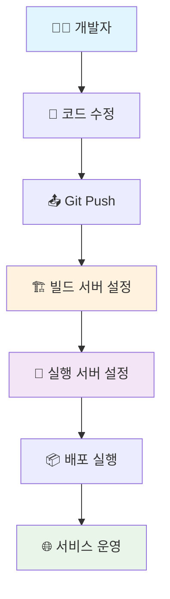
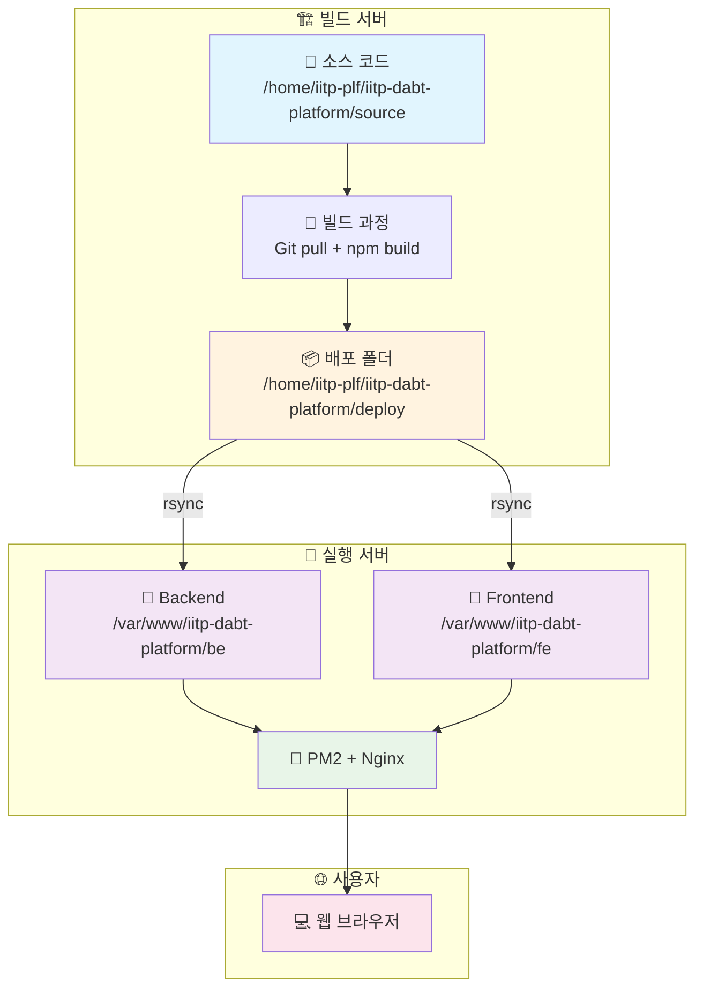
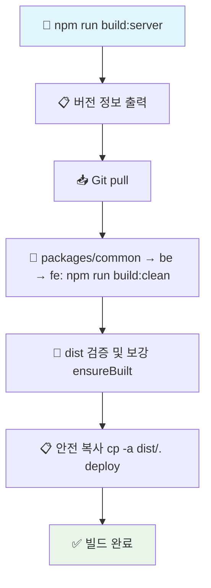

# 🚀 IITP DABT Platform 서버 배포 가이드 (Server-to-Server Deployment)

본 문서는 **빌드 서버**와 **실행 서버**가 분리된 환경에서의 배포 가이드입니다.

> **중요**: Platform 서비스는 기존 Admin 서비스와 **동일 실행 서버에서 공존**합니다.
> - **Admin 서비스**: `/adm`, `/adm/api` (포트 30000)
> - **Platform 서비스**: `/plf`, `/plf/api` (포트 33000)

## 📋 목차
0. [실제 배포 Flow](#0-실제-배포-flow)
1. [빌드 서버 설정 및 운영](#1-빌드-서버-설정-및-운영)
2. [실행 서버 설정 및 운영](#2-실행-서버-설정-및-운영)
3. [배포 스크립트 상세 가이드](#3-배포-스크립트-상세-가이드)
4. [문제 해결 및 모니터링](#4-문제-해결-및-모니터링)

## 🔄 0. 실제 배포 Flow

### 전체 Flow (첫 설치부터 배포까지)


### 일상 배포 Flow (설정 완료 후)


### 서버 간 배포 아키텍처


## 🏗️ 1. 빌드 서버 설정 및 운영

### 1.1 초기 설정 (First Time Setup)

#### 1.1.1 서버 준비
```bash
# Ubuntu 20.04+ 기준
sudo apt update
sudo apt upgrade -y

# Node.js 22.x 설치
curl -fsSL https://deb.nodesource.com/setup_22.x | sudo -E bash -
sudo apt-get install -y nodejs

# Git 설치
sudo apt install git -y
```

#### 1.1.2 프로젝트 설정
```bash
# 1. iitp-plf 사용자 생성 (존재하지 않는 경우)
sudo useradd -m -s /bin/bash iitp-plf
sudo passwd iitp-plf

# 2. 기본 디렉토리 생성
sudo mkdir -p /home/iitp-plf/iitp-dabt-platform/source
sudo mkdir -p /home/iitp-plf/iitp-dabt-platform/deploy
sudo chown -R iitp-plf:iitp-plf /home/iitp-plf/iitp-dabt-platform

# 3. iitp-plf 사용자로 전환
sudo -iu iitp-plf

# 4. Git에서 소스 다운로드
cd /home/iitp-plf/iitp-dabt-platform/source
git clone https://github.com/sweetk-dev/06-IITP-DABT-Platform.git .

# 5. 환경 변수 설정
cp script/server/env.sample.build-server script/server/.env
vi script/server/.env

# 6. 의존성 설치
npm install
```

#### 1.1.3 빌드 서버 환경 변수 설정
```bash
# script/server/.env 파일 내용
GIT_REPO_URL=https://github.com/sweetk-dev/06-IITP-DABT-Platform.git
GIT_BRANCH=main

SOURCE_PATH=/home/iitp-plf/iitp-dabt-platform/source
DEPLOY_PATH=/home/iitp-plf/iitp-dabt-platform/deploy

NODE_ENV=production
NPM_CONFIG_PRODUCTION=true
```

### 1.2 일상 운영 (Daily Operations)

#### 1.2.1 전체 빌드 및 배포
```bash
# 빌드 서버에서 실행
cd /home/iitp-plf/iitp-dabt-platform/source

# Frontend 빌드용 환경변수 설정 (필수!)
export VITE_BASE=/plf/
export VITE_API_BASE_URL=/plf

# 전체 빌드
npm run build:server
```

> **중요**(Frontend 빌드 환경변수): Vite의 `VITE_*` 변수는 "빌드 시점"에만 주입됩니다. 실행 서버의 `fe/.env`는 프로덕션(dist) 런타임에 영향을 주지 않습니다. 서브패스(`/plf/`) 배포 시에는 빌드 전에 아래를 설정하고 빌드하세요.
>
> ```bash
> # Platform이 /plf/에서 서빙되고 API가 /plf/api로 프록시되는 경우
> export VITE_BASE=/plf/
> export VITE_API_BASE_URL=/plf
> # 주의: VITE_API_BASE_URL=/plf (not /plf/api)
> # FE 코드가 FULL_API_URLS를 사용하여 /api/v1/...을 자동으로 추가함
> npm run build:server
> ```

### 1.3 빌드 스크립트 상세

#### 1.3.1 build-server.js 동작 과정


- **ensureBuilt**: dist 디렉터리가 없거나 비어 있으면 해당 패키지에서 `npm ci` 후 `npm run build:clean`을 수행해 보강합니다.
- **안전 복사**: 글롭(*)을 사용하지 않고 `cp -a dist/. <deploy>`로 디렉터리 단위 복사합니다.

#### 1.3.2 빌드 서버 디렉토리 구조
```
/home/iitp-plf/iitp-dabt-platform/
├── source/                        # 소스 코드
│   ├── packages/common/
│   ├── be/
│   ├── fe/
│   ├── script/
│   └── package.json
└── deploy/                        # 배포 폴더
    ├── common/
    ├── backend/
    └── frontend/
```

## 🚀 2. 실행 서버 설정 및 운영

### 2.1 초기 설정 (First Time Setup)

#### 2.1.1 서버 준비
```bash
# Ubuntu 20.04+ 기준
sudo apt update
sudo apt upgrade -y

# Node.js 22.x 설치
curl -fsSL https://deb.nodesource.com/setup_22.x | sudo -E bash -
sudo apt-get install -y nodejs

# PM2 설치
sudo npm install -g pm2

# Nginx 설치 (이미 설치되어 있을 경우 생략)
# sudo apt install nginx -y

# PostgreSQL (이미 설치되어 있을 경우 생략)
# sudo apt install postgresql postgresql-contrib -y
```

#### 2.1.2 실행 환경 설정
```bash
# 1. iitp-plf 사용자 생성 (존재하지 않는 경우)
sudo useradd -m -s /bin/bash iitp-plf
sudo passwd iitp-plf

# 2. 기본 디렉토리 생성
sudo mkdir -p /var/www/iitp-dabt-platform/be
sudo mkdir -p /var/www/iitp-dabt-platform/fe
sudo mkdir -p /var/www/iitp-dabt-platform/script
sudo mkdir -p /var/www/iitp-dabt-platform/packages/common
sudo chown -R iitp-plf:iitp-plf /var/www/iitp-dabt-platform

# 3. PM2 부팅 자동 실행 설정
sudo env PATH=$PATH pm2 startup systemd -u iitp-plf --hp /home/iitp-plf
```

#### 2.1.3 PostgreSQL 데이터베이스 설정

```sql
-- PostgreSQL에 접속
sudo -u postgres psql

-- 기존 데이터베이스 사용 (Admin과 공유)
\c iitp_dabt

-- Platform용 사용자 생성 (별도 계정)
CREATE USER iitp_platform_user WITH PASSWORD 'your_password';
GRANT ALL PRIVILEGES ON DATABASE iitp_dabt TO iitp_platform_user;

-- 종료
\q
```

#### 2.1.4 실행 서버 환경 변수 설정

**중요**: Backend는 **실행 시점**에만 .env 파일이 필요합니다!

| 구분 | 빌드 시 | 실행 시 | 위치 |
|------|---------|---------|------|
| **Backend** | ❌ 불필요 | ✅ **필수** | `/var/www/iitp-dabt-platform/be/.env` |
| **Frontend** | ✅ 필수 (export) | ❌ 불필요 | 빌드 서버에서 export |

Backend 환경변수 파일 생성 (최초 1회): `/var/www/iitp-dabt-platform/be/.env`

```bash
# 실행 서버에서 .env 파일 생성
sudo vi /var/www/iitp-dabt-platform/be/.env
```

```env
# 서버 설정
NODE_ENV=production
PORT=33000

# 데이터베이스 설정 (Admin과 동일 DB)
DB_HOST=localhost
DB_PORT=5432
DB_NAME=iitp_dabt
DB_USER=iitp_platform_user
DB_PASSWORD=your_db_password

# OpenAPI 서버 설정 (Admin과 동일)
OPEN_API_SERVER_URL=https://api.example.com
OPEN_API_AUTH_KEY=your_api_key
OPEN_API_AUTH_SECRET=your_api_secret

# CORS 설정
CORS_ORIGINS=http://your-server-domain

# 로깅 설정
LOG_LEVEL=info
```

**주의사항**:
- ✅ `.env` 파일은 **최초 1회만 수동 생성**하면 배포 시 자동 보존됨
- ✅ 배포 스크립트가 `.env*` 파일을 exclude하므로 덮어쓰지 않음
- ❌ 빌드 서버의 BE 디렉토리에는 `.env` 불필요

#### 2.1.5 SSH 키 설정 (빌드 서버 → 실행 서버)

빌드 서버에서:
```bash
# iitp-plf 사용자로
sudo -iu iitp-plf

# SSH 키 생성 (이미 있으면 생략)
ssh-keygen -t rsa -b 4096 -C "iitp-plf@build-server"

# 공개 키를 실행 서버로 복사
ssh-copy-id iitp-plf@실행서버주소
```

### 2.2 일상 운영 (Daily Operations)

#### 2.2.1 배포 전 준비 ⚠️

**실행 서버에 Backend .env 파일 생성** (최초 1회, 매우 중요!)

```bash
# 실행 서버에서 실행
sudo mkdir -p /var/www/iitp-dabt-platform/be
sudo vi /var/www/iitp-dabt-platform/be/.env
# (위 2.1.4 섹션의 .env 내용 참고)
```

**왜 필요한가?**
- Backend는 **실행 시**에만 .env 필요 (빌드 시 불필요)
- 배포 스크립트는 `.env` 파일을 **절대 배포하지 않음** (exclude 설정)
- 따라서 **수동으로 생성**해야 함

#### 2.2.2 배포 받기 및 실행

빌드 서버(또는 배포 전용 서버)에서 배포 스크립트 실행:
```bash
cd /home/iitp-plf/iitp-dabt-platform/source

# 배포 스크립트용 .env 작성 (최초 1회)
cp script/server/env.sample.deploy-server script/server/.env
vi script/server/.env

# 배포 실행
npm run deploy:server

# 배포 후 실행 서버에서 .env 파일 확인 필수!
# ssh iitp-plf@실행서버주소
# ls -la /var/www/iitp-dabt-platform/be/.env
```

> **중요**: Backend는 최초 배포 또는 `be/package.json` 변경 시 실행 서버에서 의존성 설치가 필요합니다.
> ```bash
> # 실행 서버에서
> cd /var/www/iitp-dabt-platform/be
> npm ci --omit=dev || npm install --omit=dev
> pm2 restart iitp-dabt-plf-be
> ```
> Frontend는 정적 산출물만 배포되므로 실행 서버에서 `npm install`이 필요하지 않습니다.

#### 2.2.2 서버 관리

실행 서버에서:
```bash
cd /var/www/iitp-dabt-platform

# Backend 서버 시작
npm run start:server:be

# Frontend 서버 시작 (Nginx)
npm run start:server:fe

# Backend 서버 재시작
npm run restart:server:be

# Frontend 서버 재시작 (Nginx reload)
npm run restart:server:fe

# 서버 중지
npm run stop:server:be
npm run stop:server:fe
```

### 2.3 Nginx 설정 (Admin과 공존)

실행 서버의 Nginx 설정에 Platform location 블록을 추가합니다.

파일: `/etc/nginx/conf.d/iitp-services.conf`

```nginx
upstream iitp_dabt_admin_backend {
    server 127.0.0.1:30000;
    keepalive 32;
}

upstream iitp_dabt_platform_backend {
    server 127.0.0.1:33000;
    keepalive 32;
}

server {
    listen 80 default_server;
    listen [::]:80 default_server;
    server_name _;

    root /var/www/html;

    # ========================================
    # Admin 서비스 (기존)
    # ========================================
    
    location = /adm {
        return 301 /adm/;
    }

    location ^~ /adm/assets/ {
        alias /var/www/iitp-dabt-admin/fe/dist/assets/;
        try_files $uri =404;
        expires 7d;
        add_header Cache-Control "public, max-age=604800";
    }

    location ~* ^/adm/(.+\.(png|jpg|jpeg|gif|svg|ico|woff2?|js|css))$ {
        alias /var/www/iitp-dabt-admin/fe/dist/$1;
        try_files $uri =404;
        expires 7d;
        add_header Cache-Control "public, max-age=604800";
    }

    location ^~ /adm/ {
        alias /var/www/iitp-dabt-admin/fe/dist/;
        index index.html;
        try_files $uri $uri/ /index.html;
    }

    location /adm/api/ {
        proxy_pass http://iitp_dabt_admin_backend/api/;
        proxy_http_version 1.1;
        proxy_read_timeout 120s;
        proxy_send_timeout 120s;

        proxy_set_header Host $host;
        proxy_set_header X-Real-IP $remote_addr;
        proxy_set_header X-Forwarded-For $proxy_add_x_forwarded_for;
        proxy_set_header X-Forwarded-Proto $scheme;

        client_max_body_size 20m;
    }

    # ========================================
    # Platform 서비스 (신규)
    # ========================================
    
    location = /plf {
        return 301 /plf/;
    }

    location ^~ /plf/assets/ {
        alias /var/www/iitp-dabt-platform/fe/dist/assets/;
        try_files $uri =404;
        expires 7d;
        add_header Cache-Control "public, max-age=604800";
    }

    location ~* ^/plf/(.+\.(png|jpg|jpeg|gif|svg|ico|woff2?|js|css))$ {
        alias /var/www/iitp-dabt-platform/fe/dist/$1;
        try_files $uri =404;
        expires 7d;
        add_header Cache-Control "public, max-age=604800";
    }

    location ^~ /plf/ {
        alias /var/www/iitp-dabt-platform/fe/dist/;
        index index.html;
        try_files $uri $uri/ /index.html;
    }

    location /plf/api/ {
        proxy_pass http://iitp_dabt_platform_backend/api/;
        proxy_http_version 1.1;
        proxy_read_timeout 120s;
        proxy_send_timeout 120s;

        proxy_set_header Host $host;
        proxy_set_header X-Real-IP $remote_addr;
        proxy_set_header X-Forwarded-For $proxy_add_x_forwarded_for;
        proxy_set_header X-Forwarded-Proto $scheme;

        client_max_body_size 20m;
    }

    # 보안 헤더
    add_header X-Frame-Options SAMEORIGIN always;
    add_header X-Content-Type-Options nosniff always;
    add_header Referrer-Policy strict-origin-when-cross-origin always;
}
```

적용:
```bash
sudo nginx -t
sudo systemctl reload nginx
```

## 🔧 3. 배포 스크립트 상세 가이드

### 3.1 환경 변수 설정

#### 3.1.1 빌드 서버 환경 변수

파일: `script/server/.env` (빌드 서버용)

```bash
# Git 설정
GIT_REPO_URL=https://github.com/sweetk-dev/06-IITP-DABT-Platform.git
GIT_BRANCH=main

# 경로 설정
SOURCE_PATH=/home/iitp-plf/iitp-dabt-platform/source
DEPLOY_PATH=/home/iitp-plf/iitp-dabt-platform/deploy

# 빌드 설정
NODE_ENV=production
NPM_CONFIG_PRODUCTION=true
```

#### 3.1.2 배포 스크립트 환경 변수

파일: `script/server/.env` (배포용, 빌드 서버 또는 별도 배포 서버에서 실행)

```bash
# 빌드 서버 설정
BUILD_SERVER_HOST=빌드서버주소
BUILD_SERVER_USER=iitp-plf
BUILD_SERVER_PATH=/home/iitp-plf/iitp-dabt-platform/deploy
BUILD_SERVER_PORT=22

# 실행 서버 설정
PROD_SERVER_HOST=실행서버주소
PROD_SERVER_USER=iitp-plf
PROD_SERVER_PORT=22

PROD_BE_PATH=/var/www/iitp-dabt-platform/be
PROD_FE_PATH=/var/www/iitp-dabt-platform/fe

# Backend 기동 설정
PM2_APP_NAME_BE=iitp-dabt-plf-be
```

### 3.2 배포 명령어

```bash
# 전체 배포
npm run deploy:server

# 개별 배포
npm run deploy:server:be    # Backend만
npm run deploy:server:fe    # Frontend만

# 운영 스크립트 배포 (최초 1회 또는 변경 시)
npm run deploy:server:ops
```

## 🆘 4. 문제 해결 및 모니터링

### 4.1 빌드 서버 문제 해결

#### Git pull 실패
```bash
# SSH 키 확인
ssh -T git@github.com

# 브랜치 충돌 해결
git fetch origin
git reset --hard origin/main
```

#### 빌드 실패
```bash
# 캐시 정리 후 재설치
npm cache clean --force
rm -rf node_modules package-lock.json
npm install

# TypeScript 컴파일 오류
npm run build:be
```

### 4.2 실행 서버 문제 해결

#### PM2 프로세스 확인
```bash
# PM2 상태
pm2 status

# PM2 로그
pm2 logs iitp-dabt-plf-be --lines 200

# PM2 재시작
pm2 restart iitp-dabt-plf-be
```

#### 포트 충돌 확인
```bash
# Admin(30000), Platform(33000) 포트 확인
sudo netstat -tulpn | grep -E ':(30000|33000)'

# 포트 사용 중인 프로세스 확인
sudo lsof -i :33000
```

#### Nginx 문제
```bash
# Nginx 설정 테스트
sudo nginx -t

# Nginx 에러 로그
sudo tail -f /var/log/nginx/error.log

# Nginx 재시작
sudo systemctl restart nginx
```

### 4.3 모니터링

#### 서버 상태 모니터링
```bash
# 시스템 리소스
htop
df -h
free -h

# 서비스 상태
pm2 status
pm2 monit
sudo systemctl status nginx
```

#### 로그 모니터링
```bash
# Backend 로그
pm2 logs iitp-dabt-plf-be
tail -f /var/www/iitp-dabt-platform/be/logs/app.log

# Nginx 로그
sudo tail -f /var/log/nginx/access.log
sudo tail -f /var/log/nginx/error.log
```

#### 헬스체크
```bash
# Admin 헬스체크
curl http://localhost:30000/api/common/health
curl http://서버주소/adm/api/common/health

# Platform 헬스체크
curl http://localhost:33000/api/common/health
curl http://서버주소/plf/api/common/health
```

## ✅ 배포 체크리스트

### 빌드 서버 체크리스트
- [ ] Git 저장소 접근 가능
- [ ] Node.js 22.x 설치됨
- [ ] 환경 변수 설정됨
- [ ] SSH 키 설정됨 (실행 서버로)
- [ ] 디스크 공간 충분함 (최소 10GB)

### 실행 서버 체크리스트
- [ ] PM2 설치 및 설정됨
- [ ] Nginx 설치 및 설정됨
- [ ] PostgreSQL 설정됨 (Admin과 공유)
- [ ] Platform용 DB 사용자 생성됨
- [ ] Backend .env 파일 생성됨
- [ ] SSH 접근 가능 (빌드 서버로부터)
- [ ] 방화벽 설정됨 (포트 33000)

## 💡 팁

### 배포 자동화
```bash
# Cron을 이용한 자동 배포 (선택사항)
# 매일 오전 2시에 자동 빌드
0 2 * * * cd /home/iitp-plf/iitp-dabt-platform/source && export VITE_BASE=/plf/ && export VITE_API_BASE_URL=/plf/api && npm run build:server
```

### 백업
```bash
# 데이터베이스 백업
pg_dump iitp_dabt > backup_$(date +%Y%m%d).sql

# 파일 백업
tar -czf backup_$(date +%Y%m%d).tar.gz /var/www/iitp-dabt-platform/be
```

---

**이 가이드를 따라하면 안정적인 서버 간 배포 환경을 구축할 수 있습니다!** 🚀

**IITP DABT Platform Team** © 2025

