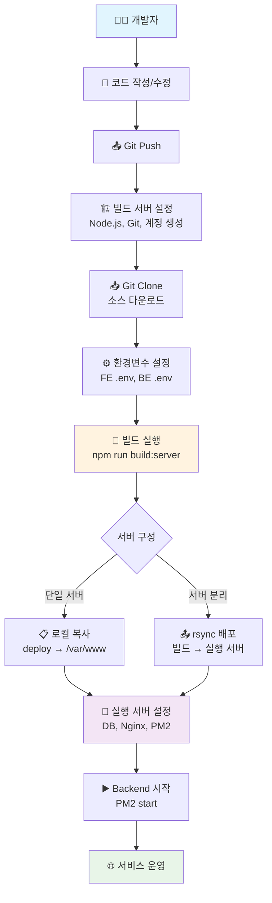
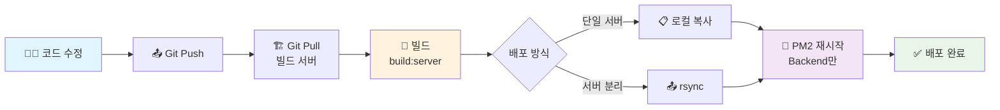
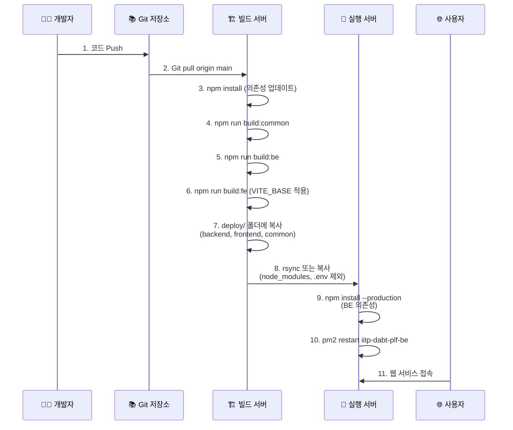
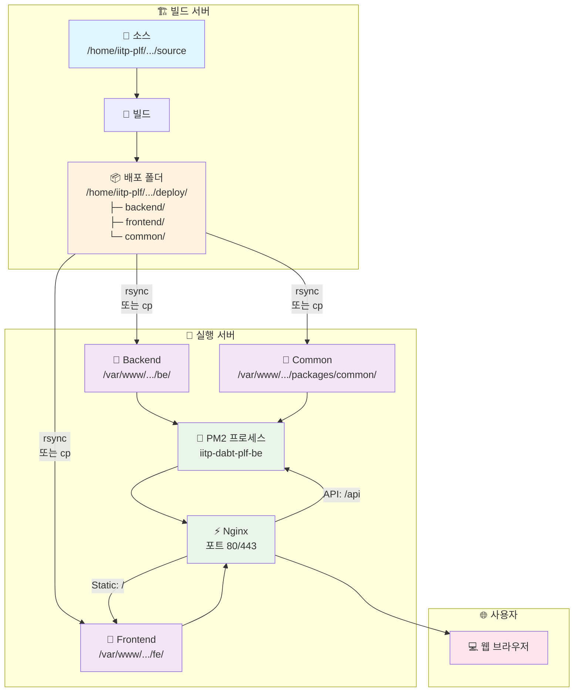

# 🚀 IITP DABT Platform 단독 설치 가이드 (Standalone Deployment)

본 문서는 **Platform 서비스만 단독으로 설치**하는 경우의 완전한 가이드입니다.

> **📌 배포 경로 설정**
> 
> 이 가이드는 **Platform 단독 설치** 기준입니다 (서비스 경로: `/`)
> 
> **서브패스 사용이 필요한 경우** (예: 다른 서비스와 공존):
> - 이 문서의 모든 `/`를 원하는 경로로 치환 (예: `/` → `/hub`)
> - 환경변수: `VITE_BASE=/hub/`, `VITE_API_BASE_URL=/hub`
> - Nginx: `location /` → `location /hub/`, `location /api/` → `location /hub/api/`
> - 예시: [복합 서비스 설치 가이드](./README-MULTI-SERVICE-DEPLOYMENT.md) 참조
>
> **이 문서대로 순서대로 실행하면 빌드 → 배포 → 실행 동작합니다.**

## 📋 목차

### 0. [개요 및 사전 요구사항](#0-개요-및-사전-요구사항)
- [0.1 서버 환경 선택](#01-서버-환경-선택)
- [0.2 시스템 요구사항](#02-시스템-요구사항)

### 1. [초기 설치 - 단일 서버 환경](#1-초기-설치---단일-서버-환경)
- [1.0 서버 기본 세팅](#10-서버-기본-세팅)
- [1.1 운영 계정 및 디렉토리 구조 생성](#11-운영-계정-및-디렉토리-구조-생성)
- [1.2 데이터베이스 설정](#12-데이터베이스-설정)
- [1.3 프로젝트 클론 및 초기 설정](#13-프로젝트-클론-및-초기-설정)
- [1.4 환경변수 설정](#14-환경변수-설정)
- [1.5 빌드](#15-빌드)
- [1.6 배포 (단일 서버)](#16-배포-단일-서버)
- [1.7 Backend 실행 환경 설정](#17-backend-실행-환경-설정)
- [1.8 Nginx 설정 (루트 경로)](#18-nginx-설정-루트-경로)
- [1.9 서비스 시작](#19-서비스-시작)
- [1.10 검증](#110-검증)

### 2. [초기 설치 - 서버 분리 환경](#2-초기-설치---서버-분리-환경)
- [2.1 빌드 서버 설정](#21-빌드-서버-설정)
- [2.2 실행 서버 설정](#22-실행-서버-설정)
- [2.3 빌드 및 배포](#23-빌드-및-배포)
- [2.4 실행 서버에서 Backend 실행 준비](#24-실행-서버에서-backend-실행-준비)
- [2.5 Nginx 설정](#25-nginx-설정)
- [2.6 서비스 시작](#26-서비스-시작)
- [2.7 검증](#27-검증)

### 3. [업데이트 배포 (일상 운영)](#3-업데이트-배포-일상-운영)
- [3.1 사전 확인 및 백업](#31-사전-확인-및-백업)
- [3.2 소스 업데이트](#32-소스-업데이트)
- [3.3 의존성 업데이트 확인](#33-의존성-업데이트-확인)
- [3.4 빌드](#34-빌드)
- [3.5 배포](#35-배포)
- [3.6 서비스 재시작](#36-서비스-재시작)
- [3.7 검증](#37-검증)
- [3.8 롤백 (문제 발생 시)](#38-롤백-문제-발생-시)

### 4. [서비스 운영 관리](#4-서비스-운영-관리)
- [4.1 서비스 관리](#41-서비스-관리)
- [4.2 로그 관리](#42-로그-관리)
- [4.3 모니터링](#43-모니터링)
- [4.4 데이터베이스 관리](#44-데이터베이스-관리)

### 5. [문제 해결 및 FAQ](#5-문제-해결-및-faq)
- [5.1 일반적인 문제](#51-일반적인-문제)
- [5.2 FAQ](#52-faq)

### 📋 [체크리스트](#-체크리스트)
- [초기 설치 체크리스트](#초기-설치-체크리스트)
- [업데이트 배포 체크리스트](#업데이트-배포-체크리스트)

---

## 0. 개요 및 사전 요구사항

### 0.1 배포 Flow 개요

#### 전체 Flow (초기 설치)



#### 업데이트 배포 Flow (일상 운영)



#### 상세 빌드 및 배포 과정



#### 디렉토리 구조 및 배포 경로



### 0.2 서버 환경 선택

**단일 서버 환경** (섹션 1):
- 빌드 서버 = 실행 서버 (같은 서버에서 빌드와 실행)

**서버 분리 환경** (섹션 2):
- 빌드 서버 ≠ 실행 서버 (서버 분리)

### 0.2 시스템 요구사항

**공통 요구사항:**
- OS: Ubuntu 20.04+ (또는 CentOS 7+, Debian 10+)
- Node.js: 22.x 이상
- npm: 9.x 이상
- PostgreSQL: 12.x 이상
- Nginx: 1.18 이상
- PM2: 최신 버전
- Git: 2.x 이상

**하드웨어 권장사항:**
- CPU: 2 Core 이상
- RAM: 4GB 이상
- Disk: 20GB 이상 여유 공간

---

## 1. 초기 설치 - 단일 서버 환경

> **전제조건**: 빌드 서버 = 실행 서버 (같은 서버에서 모든 작업 수행)

### 1.0 서버 기본 세팅

```bash
# Ubuntu 20.04+ 기준
sudo apt update && sudo apt upgrade -y

# 필수 패키지 설치
sudo apt install -y git curl unzip jq build-essential nginx
```

#### Node.js 설치 (아래 중 하나 선택)

**방법 1: nvm 사용 (권장 - 버전 관리 용이)**
```bash
# nvm 설치
curl -o- https://raw.githubusercontent.com/nvm-sh/nvm/v0.39.0/install.sh | bash
source ~/.bashrc

# Node.js 22 설치
nvm install 22
nvm use 22
nvm alias default 22

# 버전 확인
node -v  # v22.x.x
npm -v   # 9.x.x 이상
```

**방법 2: snap 사용 (가장 간단)**
```bash
sudo snap install node --classic --channel=22

# 버전 확인
node -v
npm -v
```

**방법 3: NodeSource 사용 (전통적 방식)**
```bash
curl -fsSL https://deb.nodesource.com/setup_22.x | sudo -E bash -
sudo apt install -y nodejs

# 버전 확인
node -v
npm -v
```

**어느 방법을 선택하든 결과는 동일합니다.**

**설치 확인 방법 (설치 방식별):**

```bash
# 공통 확인
node -v  # v22.x.x
npm -v   # 9.x.x 이상

# nvm으로 설치한 경우
nvm current  # v22.x.x
nvm list     # 설치된 버전 목록

# snap으로 설치한 경우
snap list | grep node

# NodeSource로 설치한 경우
apt list --installed | grep nodejs
```

#### PM2 및 PostgreSQL 설치

```bash
# PM2 글로벌 설치
sudo npm install -g pm2

# PM2 시작 스크립트 등록 (부팅 시 자동 시작)
pm2 startup
# 출력되는 명령어 실행 (sudo env PATH=... 형태)

# PostgreSQL 설치 (이미 설치되어 있으면 생략)
sudo apt install -y postgresql postgresql-contrib

# Nginx 상태 확인
sudo systemctl status nginx
sudo nginx -t
```

### 1.1 운영 계정 및 디렉토리 구조 생성

```bash
# iitp-plf 사용자 생성
sudo useradd -m -s /bin/bash iitp-plf
sudo passwd iitp-plf

# 빌드/소스 디렉토리 생성
sudo mkdir -p /home/iitp-plf/iitp-dabt-platform/source
sudo mkdir -p /home/iitp-plf/iitp-dabt-platform/deploy
sudo chown -R iitp-plf:iitp-plf /home/iitp-plf/iitp-dabt-platform

# 실행 디렉토리 생성
sudo mkdir -p /var/www/iitp-dabt-platform/be
sudo mkdir -p /var/www/iitp-dabt-platform/fe
sudo mkdir -p /var/www/iitp-dabt-platform/script
sudo mkdir -p /var/www/iitp-dabt-platform/packages/common
sudo chown -R iitp-plf:iitp-plf /var/www/iitp-dabt-platform

# 디렉토리 구조 확인
tree -L 2 /home/iitp-plf/iitp-dabt-platform
tree -L 2 /var/www/iitp-dabt-platform
```

**디렉토리 설명:**
- `/home/iitp-plf/iitp-dabt-platform/source`: Git 소스 코드
- `/home/iitp-plf/iitp-dabt-platform/deploy`: 빌드 결과물
- `/var/www/iitp-dabt-platform/be`: Backend 실행 디렉토리
- `/var/www/iitp-dabt-platform/fe`: Frontend 정적 파일
- `/var/www/iitp-dabt-platform/packages/common`: 공통 패키지 (BE에서 참조)

### 1.2 데이터베이스 설정

```bash
# PostgreSQL 접속
sudo -u postgres psql

# 데이터베이스 생성
CREATE DATABASE iitp_dabt;

# Platform용 사용자 생성
CREATE USER iitp_platform_user WITH PASSWORD 'your_secure_password';

# 권한 부여
GRANT ALL PRIVILEGES ON DATABASE iitp_dabt TO iitp_platform_user;

# 종료
\q
```

**보안 강화 (선택사항):**
```bash
# PostgreSQL 외부 접속 차단 (로컬만 허용)
sudo vi /etc/postgresql/*/main/pg_hba.conf
# local   all   iitp_platform_user   md5

sudo systemctl restart postgresql
```

### 1.3 프로젝트 클론 및 초기 설정

```bash
# iitp-plf 사용자로 전환
sudo -iu iitp-plf

# Git에서 소스 다운로드
cd /home/iitp-plf/iitp-dabt-platform/source
git clone https://github.com/sweetk-dev/06-IITP-DABT-Platform.git .

# 브랜치 확인 (main 브랜치 사용)
git branch
git status

# 전체 패키지 설치
npm install

# 설치 확인
ls -la node_modules/
ls -la packages/common/node_modules/
ls -la be/node_modules/
ls -la fe/node_modules/
```

### 1.4 환경변수 설정

#### 1.4.1 Backend 환경변수 (실행 서버용)

**Backend는 실행 시에만 환경변수 필요** (빌드 시 불필요)

```bash
# 실행 서버 디렉토리에 .env 생성 (최초 1회)
sudo vi /var/www/iitp-dabt-platform/be/.env
```

내용:
```env
# 서버 설정
NODE_ENV=production
PORT=33000

# 데이터베이스 설정
DB_HOST=localhost
DB_PORT=5432
DB_NAME=iitp_dabt
DB_USER=iitp_platform_user
DB_PASSWORD=your_secure_password
DB_SSL=false

# CORS 설정 (실제 서버 주소로 변경)
CORS_ORIGINS=http://your-server-ip-or-domain

# OpenAPI 서버 설정 (실제 값으로 변경)
OPEN_API_SERVER_URL=https://api.example.com
OPEN_API_AUTH_KEY=your_api_key_here
OPEN_API_AUTH_SECRET=your_api_secret_here
OPEN_API_PAGE_SIZE=100
OPEN_API_TIMEOUT=30000

# 로깅 설정
LOG_LEVEL=info
LOG_DIR=./logs

# 보안 설정
ENC_SECRET=your_encryption_secret_key_here

# 기타 설정
API_RATE_LIMIT=100
REQUEST_TIMEOUT=30000
```

**권한 설정:**
```bash
sudo chown iitp-plf:iitp-plf /var/www/iitp-dabt-platform/be/.env
sudo chmod 600 /var/www/iitp-dabt-platform/be/.env
```

#### 1.4.2 Frontend 빌드 환경변수 (빌드 서버용)

**Frontend는 빌드 시에만 환경변수 필요** (실행 시 불필요)

**방법 1: .env 파일 사용 (권장)**

```bash
# 빌드 서버 소스 디렉토리에 .env 생성
cd /home/iitp-plf/iitp-dabt-platform/source/fe
cp env.sample .env
vi .env
```

내용 (단독 설치 기준):
```env
# 프로덕션 빌드용 설정 (단독 설치)
VITE_PORT=5173
VITE_BASE=/
VITE_API_BASE_URL=http://your-server-ip-or-domain
VITE_API_TIMEOUT=10000
VITE_API_DATA_PREVIEW_LIMIT=10
VITE_VISUAL_TOOL=http://your-server-ip:visual-tool-port/
VITE_EMPLOYMENT_SITE_URL=https://www.ablejob.co.kr/
VITE_OPEN_API_CENTER_URL=http://your-server-ip/admin/
VITE_OPEN_API_CENTER_ABOUT_URL=http://your-server-ip/admin/about
```

**중요 설정 설명:**
- `VITE_BASE=/`: 단독 설치는 루트 경로 사용
- `VITE_API_BASE_URL=http://your-server-ip-or-domain`: API 서버 주소 (프록시 없이 직접 호출 시)
  - Nginx 프록시 사용 시: `VITE_API_BASE_URL=` (빈 값 또는 상대 경로)
- FE 코드가 자동으로 `/api/v1/...`을 추가하므로 `/api` 포함 금지

**방법 2: shell 환경변수 export (대안)**

```bash
export VITE_PORT=5173
export VITE_BASE=/
export VITE_API_BASE_URL=http://your-server-ip
export VITE_API_TIMEOUT=10000
export VITE_API_DATA_PREVIEW_LIMIT=10
export VITE_VISUAL_TOOL=http://your-server-ip:visual-tool-port/
export VITE_EMPLOYMENT_SITE_URL=https://www.ablejob.co.kr/
export VITE_OPEN_API_CENTER_URL=http://your-server-ip/admin/
export VITE_OPEN_API_CENTER_ABOUT_URL=http://your-server-ip/admin/about
```

#### 1.4.3 빌드 스크립트 환경변수 (선택사항)

자동화 스크립트 사용 시:

```bash
cd /home/iitp-plf/iitp-dabt-platform/source
cp script/server/env.sample.build-server script/server/.env
vi script/server/.env
```

내용:
```env
# Git 설정
GIT_REPO_URL=https://github.com/sweetk-dev/06-IITP-DABT-Platform.git
GIT_BRANCH=main

# 경로 설정
SOURCE_PATH=/home/iitp-plf/iitp-dabt-platform/source
DEPLOY_PATH=/home/iitp-plf/iitp-dabt-platform/deploy

# 실행 서버 경로 (단일 서버이므로 localhost 또는 생략)
PROD_BE_PATH=/var/www/iitp-dabt-platform/be
PROD_FE_PATH=/var/www/iitp-dabt-platform/fe
OPS_SCRIPT_PATH=/var/www/iitp-dabt-platform/script

# 빌드 설정
NODE_ENV=production
NPM_CONFIG_PRODUCTION=true
```

### 1.5 빌드

```bash
cd /home/iitp-plf/iitp-dabt-platform/source

# 전체 빌드 (common → be → fe 순서로 빌드)
npm run build:server

# 또는 개별 빌드
npm run build:server:common  # 공통 패키지만
npm run build:server:be      # Backend만
npm run build:server:fe      # Frontend만
```

**빌드 확인:**
```bash
# 빌드 결과물 확인
ls -la /home/iitp-plf/iitp-dabt-platform/deploy/be/dist/
ls -la /home/iitp-plf/iitp-dabt-platform/deploy/fe/dist/
ls -la /home/iitp-plf/iitp-dabt-platform/deploy/packages/common/dist/

# 빌드 정보 확인
cat /home/iitp-plf/iitp-dabt-platform/deploy/be/buildInfo.json
cat /home/iitp-plf/iitp-dabt-platform/deploy/fe/buildInfo.json
```

### 1.6 배포 (단일 서버)

단일 서버에서는 빌드 결과를 실행 디렉토리로 복사합니다.

```bash
cd /home/iitp-plf/iitp-dabt-platform/source

# Backend 배포
cp -r /home/iitp-plf/iitp-dabt-platform/deploy/backend/* /var/www/iitp-dabt-platform/be/

# Frontend 배포
cp -r /home/iitp-plf/iitp-dabt-platform/deploy/frontend/* /var/www/iitp-dabt-platform/fe/

# 공통 패키지 배포
cp -r /home/iitp-plf/iitp-dabt-platform/deploy/common/* /var/www/iitp-dabt-platform/packages/common/

# 운영 스크립트 배포
cp -r script/server/* /var/www/iitp-dabt-platform/script/

# 권한 확인
ls -la /var/www/iitp-dabt-platform/be/
ls -la /var/www/iitp-dabt-platform/fe/
```

**중요**: 
- Backend `.env` 파일은 덮어쓰지 않도록 주의 (이미 1.4.1에서 생성함)
- `node_modules/`는 실행 서버에서 별도 설치 필요

### 1.7 Backend 실행 환경 설정

```bash
# Backend 디렉토리로 이동
cd /var/www/iitp-dabt-platform/be

# 의존성 설치 (프로덕션 모드)
npm install --production

# @iitp-dabt-platform/common 심볼릭 링크 확인
ls -la node_modules/@iitp-dabt-platform/common
# → ../../../packages/common을 가리켜야 함

# .env 파일 존재 확인
ls -la .env

# 로그 디렉토리 생성
mkdir -p logs
```

### 1.8 Nginx 설정 (루트 경로)

```bash
# Nginx 설정 파일 생성
sudo vi /etc/nginx/conf.d/iitp-dabt-platform.conf
```

내용:
```nginx
# Backend upstream
upstream iitp_dabt_platform_backend {
    server 127.0.0.1:33000;
    keepalive 32;
}

server {
    listen 80 default_server;
    listen [::]:80 default_server;
    server_name _;  # 실제 도메인으로 변경 가능

    root /var/www/iitp-dabt-platform/fe;
    index index.html;

    # ========================
    # [1] API 프록시
    # ========================
    location /api/ {
        proxy_pass http://iitp_dabt_platform_backend/api/;
        proxy_http_version 1.1;
        proxy_read_timeout 120s;
        proxy_send_timeout 120s;
        proxy_set_header Host $host;
        proxy_set_header X-Real-IP $remote_addr;
        proxy_set_header X-Forwarded-For $proxy_add_x_forwarded_for;
        proxy_set_header X-Forwarded-Proto $scheme;
        client_max_body_size 20m;
    }

    # ========================
    # [2] Frontend 정적 자산
    # ========================
    location /assets/ {
        alias /var/www/iitp-dabt-platform/fe/assets/;
        try_files $uri =404;
        expires 7d;
        add_header Cache-Control "public, max-age=604800";
    }

    # ========================
    # [3] SPA Fallback
    # ========================
    location / {
        try_files $uri $uri/ /index.html;
    }

    # ========================
    # [4] 보안 헤더
    # ========================
    add_header X-Frame-Options SAMEORIGIN always;
    add_header X-Content-Type-Options nosniff always;
    add_header Referrer-Policy strict-origin-when-cross-origin always;
}
```

**설정 검증 및 적용:**
```bash
# 기존 default 설정 비활성화 (중복 방지)
sudo rm -f /etc/nginx/sites-enabled/default

# 설정 테스트
sudo nginx -t

# Nginx 재시작
sudo systemctl restart nginx

# 상태 확인
sudo systemctl status nginx
```

### 1.9 서비스 시작

#### Backend 시작 (PM2)

```bash
cd /var/www/iitp-dabt-platform/be

# PM2로 시작
pm2 start dist/server.js --name iitp-dabt-plf-be

# 상태 확인
pm2 list
pm2 logs iitp-dabt-plf-be --lines 50

# PM2 설정 저장 (재부팅 후에도 자동 시작)
pm2 save

# 헬스체크
curl http://localhost:33000/api/common/health
```

**기대 출력:**
```json
{"status":"healthy","timestamp":"2024-01-01T00:00:00.000Z"}
```

#### Frontend 확인

```bash
# 정적 파일 확인
ls -la /var/www/iitp-dabt-platform/fe/

# 브라우저 접속 테스트
curl -I http://localhost/
```

### 1.10 검증

```bash
# Backend 헬스체크
curl http://localhost:33000/api/common/health
curl http://localhost/api/common/health  # Nginx 경유

# Backend 버전 확인
curl http://localhost:33000/api/common/version

# Frontend 접속
curl -I http://localhost/

# PM2 상태
pm2 list

# Nginx 로그
sudo tail -f /var/log/nginx/access.log
sudo tail -f /var/log/nginx/error.log

# Backend 로그
pm2 logs iitp-dabt-plf-be --lines 100
```

**성공 확인:**
- ✅ Backend 헬스체크: HTTP 200, `{"status":"healthy"}`
- ✅ Frontend: HTTP 200, HTML 응답
- ✅ PM2: `iitp-dabt-plf-be` 상태 `online`
- ✅ Nginx: 에러 로그 없음

---

## 2. 초기 설치 - 서버 분리 환경

> **전제조건**: 빌드 서버 ≠ 실행 서버 (서버가 물리적으로 분리)

### 2.1 빌드 서버 설정

#### 2.1.1 빌드 서버 기본 세팅

```bash
# Ubuntu 20.04+ 기준 (빌드 서버)
sudo apt update && sudo apt upgrade -y

# 필수 패키지 설치
sudo apt install -y git curl build-essential rsync
```

**Node.js 설치 (아래 중 하나 선택):**

섹션 1.0의 [Node.js 설치 방법](#nodejs-설치-아래-중-하나-선택) 참조 (nvm, snap, NodeSource 중 선택)

```bash
# 설치 후 버전 확인
node -v  # v22.x.x
npm -v   # 9.x.x 이상
```

#### 2.1.2 계정 및 디렉토리 생성

```bash
# iitp-plf 사용자 생성
sudo useradd -m -s /bin/bash iitp-plf
sudo passwd iitp-plf

# 디렉토리 생성
sudo mkdir -p /home/iitp-plf/iitp-dabt-platform/source
sudo mkdir -p /home/iitp-plf/iitp-dabt-platform/deploy
sudo chown -R iitp-plf:iitp-plf /home/iitp-plf/iitp-dabt-platform
```

#### 2.1.3 SSH 키 설정 (rsync용)

```bash
# iitp-plf 사용자로 전환
sudo -iu iitp-plf

# SSH 키 생성
ssh-keygen -t rsa -b 4096 -C "iitp-plf@build-server"
# Enter 3번 (비밀번호 없이)

# 공개키 확인
cat ~/.ssh/id_rsa.pub
```

**실행 서버에 공개키 등록:**
```bash
# 실행 서버에서 실행
# (빌드 서버의 공개키를 복사하여 실행 서버에 추가)
echo "ssh-rsa AAAA..." >> ~/.ssh/authorized_keys
chmod 600 ~/.ssh/authorized_keys
chmod 700 ~/.ssh
```

**연결 테스트:**
```bash
# 빌드 서버에서 실행
ssh iitp-plf@실행서버IP
# 비밀번호 없이 접속되면 성공
exit
```

#### 2.1.4 프로젝트 클론 및 설정

```bash
# iitp-plf 사용자로 (빌드 서버)
cd /home/iitp-plf/iitp-dabt-platform/source
git clone https://github.com/sweetk-dev/06-IITP-DABT-Platform.git .

# 전체 패키지 설치
npm install
```

#### 2.1.5 환경변수 설정 (빌드 서버)

**Frontend 빌드 환경변수:**
```bash
cd /home/iitp-plf/iitp-dabt-platform/source/fe
cp env.sample .env
vi .env
```

내용 (단독 설치, 실행 서버 주소 사용):
```env
VITE_PORT=5173
VITE_BASE=/
VITE_API_BASE_URL=http://실행서버IP
VITE_API_TIMEOUT=10000
VITE_API_DATA_PREVIEW_LIMIT=10
VITE_VISUAL_TOOL=http://실행서버IP:visual-tool-port/
VITE_EMPLOYMENT_SITE_URL=https://www.ablejob.co.kr/
VITE_OPEN_API_CENTER_URL=http://실행서버IP/admin/
VITE_OPEN_API_CENTER_ABOUT_URL=http://실행서버IP/admin/about
```

**빌드 스크립트 환경변수:**
```bash
cd /home/iitp-plf/iitp-dabt-platform/source
cp script/server/env.sample.build-server script/server/.env
vi script/server/.env
```

내용:
```env
GIT_REPO_URL=https://github.com/sweetk-dev/06-IITP-DABT-Platform.git
GIT_BRANCH=main
SOURCE_PATH=/home/iitp-plf/iitp-dabt-platform/source
DEPLOY_PATH=/home/iitp-plf/iitp-dabt-platform/deploy

# 실행 서버 정보
PROD_SERVER_HOST=실행서버IP
PROD_SERVER_USER=iitp-plf
PROD_SERVER_PORT=22
PROD_BE_PATH=/var/www/iitp-dabt-platform/be
PROD_FE_PATH=/var/www/iitp-dabt-platform/fe
OPS_SCRIPT_PATH=/var/www/iitp-dabt-platform/script

NODE_ENV=production
NPM_CONFIG_PRODUCTION=true
```

### 2.2 실행 서버 설정

#### 2.2.1 실행 서버 기본 세팅

```bash
# Ubuntu 20.04+ 기준 (실행 서버)
sudo apt update && sudo apt upgrade -y

# 필수 패키지 설치
sudo apt install -y curl nginx
```

**Node.js 설치 (아래 중 하나 선택):**

섹션 1.0의 [Node.js 설치 방법](#nodejs-설치-아래-중-하나-선택) 참조 (nvm, snap, NodeSource 중 선택)

```bash
# PM2 글로벌 설치
sudo npm install -g pm2

# PM2 시작 스크립트 등록 (부팅 시 자동 시작)
pm2 startup
# 출력되는 명령어 실행 (sudo env PATH=... 형태)

# PostgreSQL 설치
sudo apt install -y postgresql postgresql-contrib

# 버전 확인
node -v  # v22.x.x
npm -v   # 9.x.x 이상
pm2 -v
psql --version
```

#### 2.2.2 계정 및 디렉토리 생성

```bash
# iitp-plf 사용자 생성 (실행 서버)
sudo useradd -m -s /bin/bash iitp-plf
sudo passwd iitp-plf

# 실행 디렉토리 생성
sudo mkdir -p /var/www/iitp-dabt-platform/be
sudo mkdir -p /var/www/iitp-dabt-platform/fe
sudo mkdir -p /var/www/iitp-dabt-platform/script
sudo mkdir -p /var/www/iitp-dabt-platform/packages/common
sudo chown -R iitp-plf:iitp-plf /var/www/iitp-dabt-platform
```

#### 2.2.3 데이터베이스 설정

섹션 1.2와 동일

#### 2.2.4 Backend 환경변수 설정

```bash
# 실행 서버
sudo vi /var/www/iitp-dabt-platform/be/.env
```

내용: 섹션 1.4.1과 동일

### 2.3 빌드 및 배포

#### 2.3.1 빌드 (빌드 서버)

```bash
# 빌드 서버에서 실행
cd /home/iitp-plf/iitp-dabt-platform/source

# 전체 빌드
npm run build:server

# 빌드 확인
ls -la /home/iitp-plf/iitp-dabt-platform/deploy/
```

#### 2.3.2 배포 (빌드 서버 → 실행 서버)

**방법 1: 스크립트 사용 (권장)**

```bash
# 빌드 서버에서 실행
cd /home/iitp-plf/iitp-dabt-platform/source

# 배포 스크립트 실행
node script/server/deploy-server.js

# 운영 스크립트 배포 (최초 1회)
node script/server/deploy-server-ops.js
```

**방법 2: 수동 rsync**

```bash
# 빌드 서버에서 실행

# Backend 배포
rsync -avz --delete \
  --exclude='node_modules' --exclude='.env' \
  /home/iitp-plf/iitp-dabt-platform/deploy/be/ \
  iitp-plf@실행서버IP:/var/www/iitp-dabt-platform/be/

# Frontend 배포
rsync -avz --delete \
  /home/iitp-plf/iitp-dabt-platform/deploy/fe/dist/ \
  iitp-plf@실행서버IP:/var/www/iitp-dabt-platform/fe/

# 공통 패키지 배포
rsync -avz --delete \
  /home/iitp-plf/iitp-dabt-platform/deploy/packages/common/ \
  iitp-plf@실행서버IP:/var/www/iitp-dabt-platform/packages/common/

# 운영 스크립트 배포
rsync -avz \
  script/server/*.js script/server/.env \
  iitp-plf@실행서버IP:/var/www/iitp-dabt-platform/script/
```

### 2.4 실행 서버에서 Backend 실행 준비

```bash
# 실행 서버에서 실행
cd /var/www/iitp-dabt-platform/be

# 의존성 설치
npm install --production

# 심볼릭 링크 확인
ls -la node_modules/@iitp-dabt-platform/common

# .env 파일 확인
cat .env

# 로그 디렉토리 생성
mkdir -p logs
```

### 2.5 Nginx 설정

섹션 1.8과 동일 (실행 서버에서 설정)

### 2.6 서비스 시작

섹션 1.9와 동일 (실행 서버에서 실행)

### 2.7 검증

섹션 1.10과 동일 (실행 서버에서 확인)

---

## 3. 업데이트 배포 (일상 운영)

> **전제조건**: 섹션 1 또는 2의 초기 설치가 완료된 상태

### 3.1 사전 확인 및 백업

```bash
# 현재 버전 확인
curl http://localhost:33000/api/common/version

# 서비스 상태 확인
pm2 list
pm2 logs iitp-dabt-plf-be --lines 50

# 데이터베이스 백업 (선택사항)
pg_dump -U iitp_platform_user iitp_dabt > backup_$(date +%Y%m%d_%H%M%S).sql

# 현재 코드 백업 (선택사항)
cd /home/iitp-plf/iitp-dabt-platform
tar -czf source_backup_$(date +%Y%m%d_%H%M%S).tar.gz source/
```

### 3.2 소스 업데이트

#### 단일 서버:
```bash
cd /home/iitp-plf/iitp-dabt-platform/source
git fetch origin
git pull origin main

# 변경사항 확인
git log -5 --oneline
git diff HEAD@{1} HEAD
```

#### 빌드 서버 (서버 분리):
```bash
# 빌드 서버에서 실행
cd /home/iitp-plf/iitp-dabt-platform/source
git fetch origin
git pull origin main

# 변경사항 확인
git log -5 --oneline
```

### 3.3 의존성 업데이트 확인

```bash
# package.json 변경 확인
git diff HEAD@{1} HEAD -- package.json be/package.json fe/package.json packages/common/package.json

# 변경이 있으면 재설치
npm install
```

### 3.4 빌드

#### 단일 서버:
```bash
cd /home/iitp-plf/iitp-dabt-platform/source

# 전체 빌드
npm run build:server

# 또는 선택적 빌드
npm run build:server:be  # Backend만
npm run build:server:fe  # Frontend만
```

#### 빌드 서버 (서버 분리):
```bash
# 빌드 서버에서 실행
cd /home/iitp-plf/iitp-dabt-platform/source

# 전체 빌드
npm run build:server
```

### 3.5 배포

#### 단일 서버:
```bash
# Backend 배포 (덮어쓰기, .env는 보존)
cd /home/iitp-plf/iitp-dabt-platform/source
rsync -av --delete \
  --exclude='node_modules' --exclude='.env' --exclude='logs' \
  /home/iitp-plf/iitp-dabt-platform/deploy/backend/ \
  /var/www/iitp-dabt-platform/be/

# Frontend 배포
rsync -av --delete \
  /home/iitp-plf/iitp-dabt-platform/deploy/frontend/ \
  /var/www/iitp-dabt-platform/fe/

# 공통 패키지 배포
rsync -av --delete \
  /home/iitp-plf/iitp-dabt-platform/deploy/common/ \
  /var/www/iitp-dabt-platform/packages/common/

# Backend 의존성 업데이트 (package.json 변경 시)
cd /var/www/iitp-dabt-platform/be
npm install --production
```

#### 서버 분리:
```bash
# 빌드 서버에서 실행
cd /home/iitp-plf/iitp-dabt-platform/source

# 자동 배포 스크립트
node script/server/deploy-server.js

# 또는 수동 rsync (섹션 2.3.2 참조)
```

### 3.6 서비스 재시작

```bash
# Backend 재시작 (실행 서버)
pm2 restart iitp-dabt-plf-be

# 로그 확인
pm2 logs iitp-dabt-plf-be --lines 50

# Frontend는 정적 파일이므로 재시작 불필요
# Nginx 설정 변경 시만 reload
# sudo nginx -t
# sudo systemctl reload nginx
```

### 3.7 검증

```bash
# 버전 확인 (변경되었는지 확인)
curl http://localhost:33000/api/common/version

# 헬스체크
curl http://localhost:33000/api/common/health
curl http://localhost/api/common/health

# PM2 상태
pm2 list
pm2 logs iitp-dabt-plf-be --lines 20

# Frontend 접속 테스트
curl -I http://localhost/

# 브라우저에서 실제 접속 테스트
```

### 3.8 롤백 (문제 발생 시)

```bash
# Git 롤백 (빌드 서버 또는 단일 서버)
cd /home/iitp-plf/iitp-dabt-platform/source
git log --oneline -10
git reset --hard <이전_커밋_해시>

# 재빌드
npm run build:server

# 재배포 (섹션 3.5 참조)

# 서비스 재시작
pm2 restart iitp-dabt-plf-be

# DB 롤백 (필요 시)
psql -U iitp_platform_user iitp_dabt < backup_YYYYMMDD_HHMMSS.sql
```

---

## 4. 서비스 운영 관리

### 4.1 서비스 관리

#### PM2 명령어
```bash
# 상태 확인
pm2 list

# 로그 확인
pm2 logs iitp-dabt-plf-be
pm2 logs iitp-dabt-plf-be --lines 100

# 재시작
pm2 restart iitp-dabt-plf-be

# 중지
pm2 stop iitp-dabt-plf-be

# 시작
pm2 start iitp-dabt-plf-be

# 삭제
pm2 delete iitp-dabt-plf-be

# 메모리/CPU 모니터링
pm2 monit
```

#### Nginx 관리
```bash
# 설정 테스트
sudo nginx -t

# 재시작
sudo systemctl restart nginx

# Reload (무중단)
sudo systemctl reload nginx

# 상태 확인
sudo systemctl status nginx

# 로그 확인
sudo tail -f /var/log/nginx/access.log
sudo tail -f /var/log/nginx/error.log
```

### 4.2 로그 관리

```bash
# Backend 로그
pm2 logs iitp-dabt-plf-be

# Backend 파일 로그
tail -f /var/www/iitp-dabt-platform/be/logs/combined.log
tail -f /var/www/iitp-dabt-platform/be/logs/error.log

# Nginx 로그
sudo tail -f /var/log/nginx/access.log
sudo tail -f /var/log/nginx/error.log

# PostgreSQL 로그
sudo tail -f /var/log/postgresql/postgresql-*-main.log
```

### 4.3 모니터링

```bash
# 시스템 리소스
htop
free -h
df -h

# 네트워크
sudo netstat -tlnp | grep 33000
sudo ss -tlnp | grep 33000

# 프로세스
ps aux | grep node
ps aux | grep nginx

# PM2 모니터링
pm2 monit
```

### 4.4 데이터베이스 관리

```bash
# 백업
pg_dump -U iitp_platform_user iitp_dabt > backup_$(date +%Y%m%d_%H%M%S).sql

# 복원
psql -U iitp_platform_user iitp_dabt < backup_YYYYMMDD_HHMMSS.sql

# 접속
psql -U iitp_platform_user -d iitp_dabt

# 연결 확인
psql -U iitp_platform_user -d iitp_dabt -c "SELECT 1;"
```

---

## 5. 문제 해결 및 FAQ

### 5.1 일반적인 문제

#### Backend가 시작되지 않음
```bash
# 로그 확인
pm2 logs iitp-dabt-plf-be --lines 100

# 일반적인 원인:
# 1. .env 파일 누락
ls -la /var/www/iitp-dabt-platform/be/.env

# 2. 포트 충돌
sudo netstat -tlnp | grep 33000
# 다른 프로세스가 사용 중이면 종료

# 3. DB 연결 실패
psql -U iitp_platform_user -d iitp_dabt -c "SELECT 1;"

# 4. 의존성 문제
cd /var/www/iitp-dabt-platform/be
npm install --production

# 5. 권한 문제
sudo chown -R iitp-plf:iitp-plf /var/www/iitp-dabt-platform/be
```

#### Frontend 404 에러
```bash
# Nginx 설정 확인
sudo nginx -t

# index.html 존재 확인
ls -la /var/www/iitp-dabt-platform/fe/index.html

# Nginx 재시작
sudo systemctl restart nginx

# 로그 확인
sudo tail -f /var/log/nginx/error.log
```

#### API 호출 502 Bad Gateway
```bash
# Backend 상태 확인
pm2 list
curl http://localhost:33000/api/common/health

# Backend가 죽었으면 재시작
pm2 restart iitp-dabt-plf-be

# Nginx upstream 설정 확인
sudo nginx -t
```

### 5.2 FAQ

**Q: 빌드 시 메모리 부족 에러**
```bash
# Node.js 메모리 제한 늘리기
export NODE_OPTIONS="--max-old-space-size=4096"
npm run build:server
```

**Q: rsync 권한 에러**
```bash
# SSH 키 권한 확인
chmod 600 ~/.ssh/id_rsa
chmod 644 ~/.ssh/id_rsa.pub

# 대상 서버 authorized_keys 권한
chmod 700 ~/.ssh
chmod 600 ~/.ssh/authorized_keys
```

**Q: PM2가 재부팅 후 시작 안 됨**
```bash
# PM2 startup 재설정
pm2 unstartup
pm2 startup
# 출력되는 명령어 실행

pm2 save
```

**Q: 환경변수가 적용 안 됨 (Frontend)**
```bash
# Frontend는 빌드 시에만 주입됨
# 변경 후 반드시 재빌드 필요
cd /home/iitp-plf/iitp-dabt-platform/source
npm run build:server:fe

# 재배포
# ...
```

---

## 📋 체크리스트

### 초기 설치 체크리스트

- [ ] 서버 기본 패키지 설치 완료 (Node.js, PM2, Nginx, PostgreSQL)
- [ ] iitp-plf 사용자 생성
- [ ] 디렉토리 구조 생성
- [ ] 데이터베이스 및 사용자 생성
- [ ] Git 소스 클론
- [ ] Backend .env 파일 생성 (실행 서버)
- [ ] Frontend .env 파일 생성 (빌드 서버)
- [ ] 전체 빌드 성공
- [ ] 배포 완료
- [ ] Backend npm install 완료
- [ ] Nginx 설정 완료
- [ ] PM2로 Backend 시작 완료
- [ ] 헬스체크 성공
- [ ] Frontend 접속 성공

### 업데이트 배포 체크리스트

- [ ] 현재 버전 확인
- [ ] 백업 완료 (DB, 소스)
- [ ] Git pull 완료
- [ ] 의존성 변경 확인
- [ ] 빌드 성공
- [ ] 배포 완료
- [ ] 서비스 재시작
- [ ] 헬스체크 성공
- [ ] 버전 변경 확인
- [ ] Frontend 정상 접속

---

**이 문서대로 순서대로 실행하면 Platform 단독 설치가 완벽히 동작합니다!** 🎉

문제 발생 시: [Issues](https://github.com/sweetk-dev/06-IITP-DABT-Platform/issues)

**IITP DABT Platform Team** © 2025

